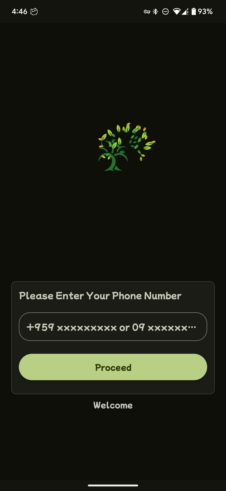
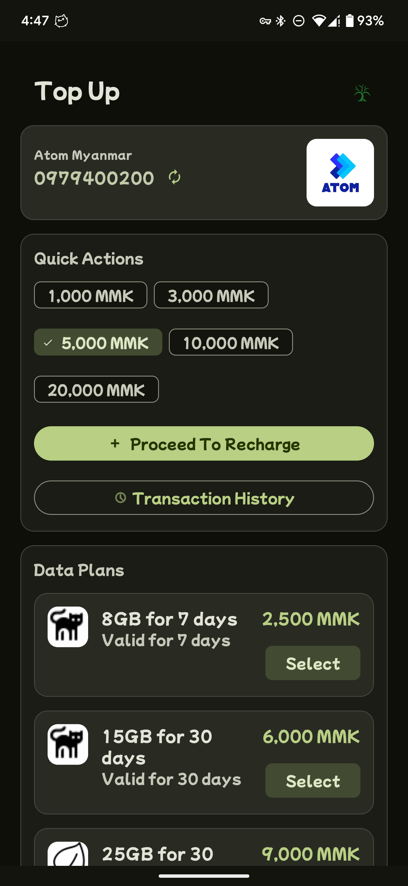
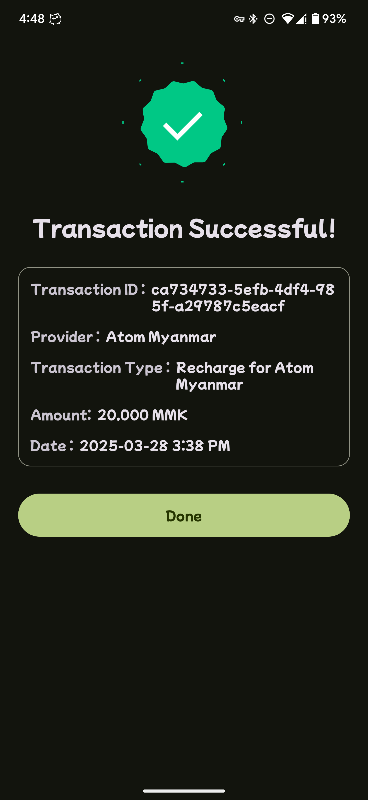
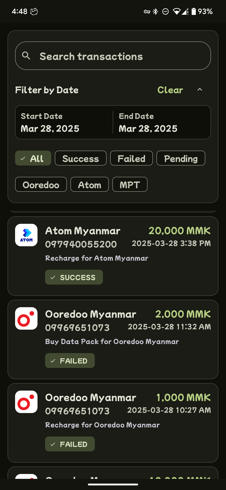

# TopUp

A modern and user-friendly mobile top-up app built with MVVM clean architecture and
material3 https://material-foundation.github.io/material-theme-builder/

## Features

- Detects telecom providers automatically from mobile numbers.
- Displays available top-up and data packages.
- Transaction history with filters and search.

## App Screenshots

| Phone Screen | Main Screen | Detail Screen |
|-------------|------------|--------------|
|  |  |  |

| History Screen |
|--------------|
|  |

